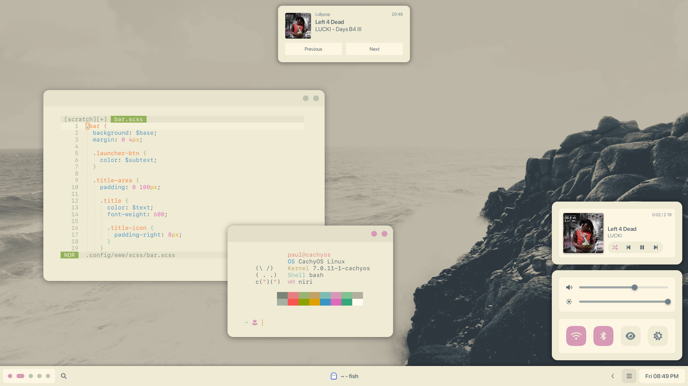
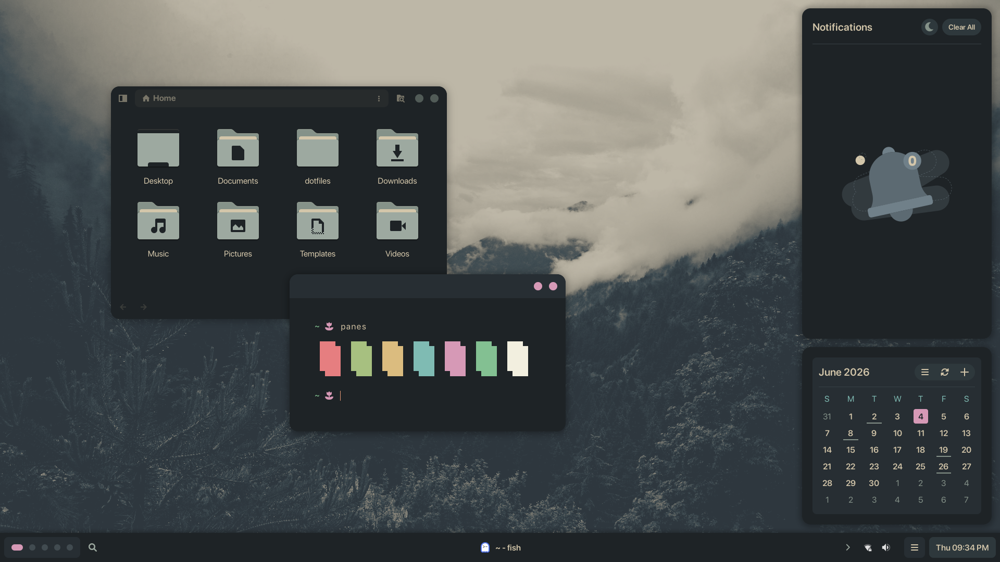
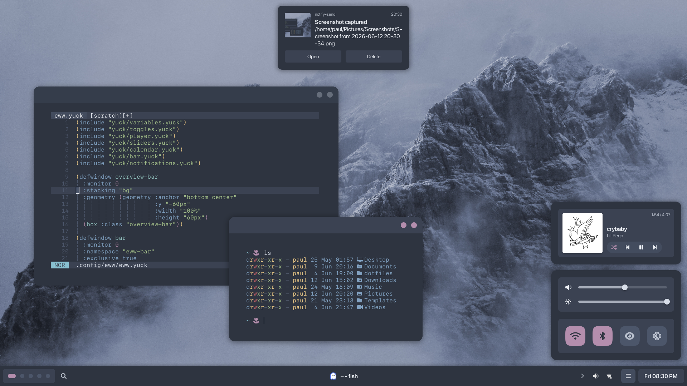
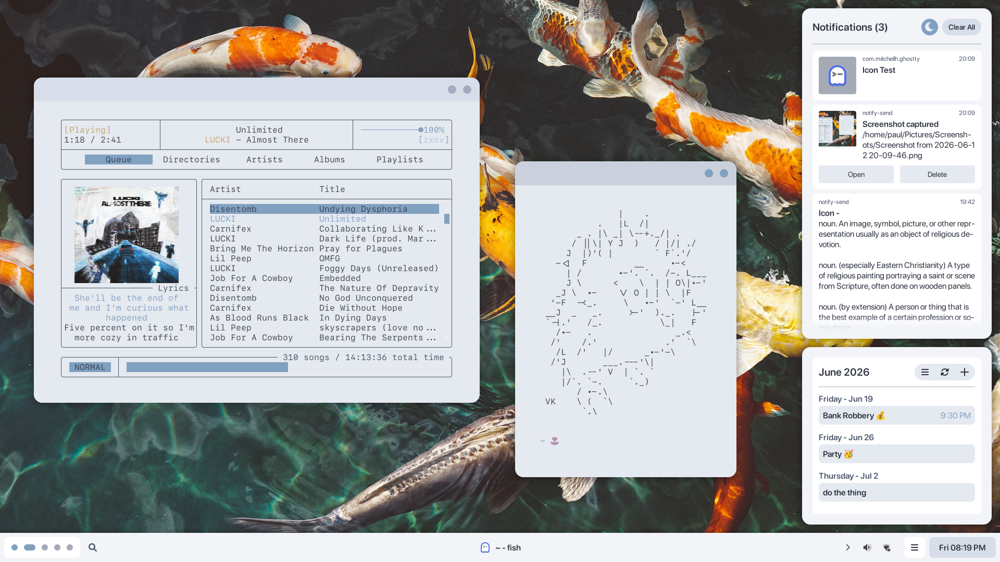

# niri dots

I barely know what I’m doing and this has only been tested on my device, so ymmv. I’d suggest using these dots only as a reference.

## Stuff

- CachyOS
- Niri
- Eww
- Ghostty
- Rofi
- Swaylock
- Font Awesome 6 Pro
- SF Pro Rounded
- SF Mono
- Papirus
